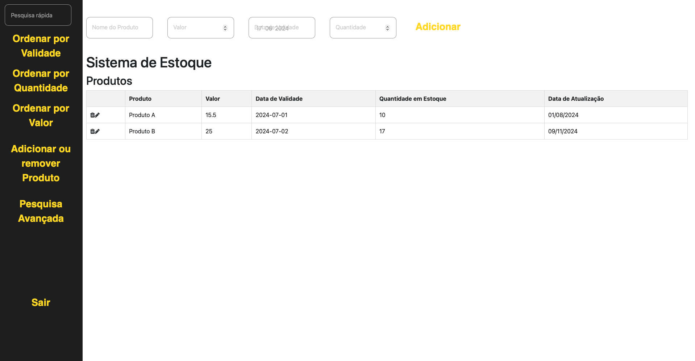

# Web-App-ONG (Crazy Cat Gang)

With my college team, we developed a web application that allows the ONG (Crazy Cat Gang) to properly manage their supply storage and ensure there are no missing items.

## Table of Contents

- [Overview](#overview)
  - [Main Panel](#1-main-panel)
  - [Login and Registration](#2-login-and-registration)
  - [Removing or adding](#3-removing-or-adding)
  - [Advanced Search](#4-advanced-search)
  - [License](#license)

## Overview

### 1. **Main Panel**:
   

 

   *This is where you can have a basic overview of the database and control it by adding/removing a product, searching, and ordering by filters.*

 

  

  *This shows the functionality of the web page.*

  

### 2. **Login and Registration**
  
 

### 3. **Removing or Adding**
   

   *In the first section, you can add the product's name and quantity. In the bottom section, it's possible to search for a product to remove it.*
   

   

  *On the right side of the screen, the available products are displayed, including their Unique Identifier (ID), Name, and Quantity. Each product has a button for removing it.*

 

### 4. **Advanced Search**
   

   *Unlike the normal search, the advanced search uses a unique ID assigned to each product, allowing for faster and more specific product searches.*

## License
This project is licensed under the [Apache License 2.0](./files/LICENSE).
